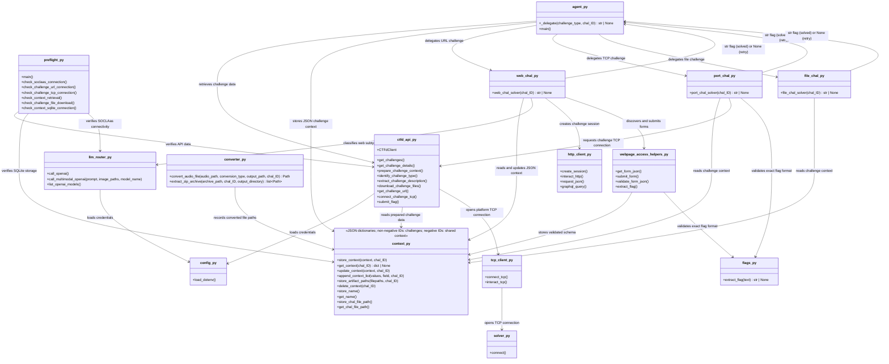

# Installation

## Local setup (PowerShell)

```powershell
git clone https://github.com/HisFun2305/incypher_agent_NameError.git
cd incypher_agent_NameError
python -m venv venv
.\venv\Scripts\Activate.ps1
pip install -r requirements.txt
Copy-Item .env.example .env
```

Configure `.env` with your credentials. For SOCLAAS, follow [https://dochub.comp.nus.edu.sg/cf/guides/soclaas/start](https://dochub.comp.nus.edu.sg/cf/guides/soclaas/start) (You need to be on NUS wifi or be logged into the NUS VPN):

```dotenv
IN_CYPHER_DOCKER_PLATFORM_AVAILABLE=false
SOCLAAS_API_KEY=your_soclass_api_key
SOCLAAS_BASE_URL=https://your-soclass-compatible-api/v1
CTFD_API_TOKEN=your_ctfd_token
PLATFORM_URL=https://hackathon.in-cypher.com
TEAM_KEY=your_team_key
```

### Optional local CyberChef support

The file solver's CyberChef adapter uses a small local Node.js application
rather than a remote server. Its `package.json`, runner, and `node_modules`
stay together under `tools/file_solve_tools/cyberchef_runner`; install its
dependencies there when that tool is needed:

```powershell
Push-Location tools/file_solve_tools/cyberchef_runner
npm install
Pop-Location
```
## Arena deployment

The arena runs a pushed Docker image unattended. Build for Linux x86_64, push
the newest `:latest` image to your team registry repository, and let the next
arena cycle run it. At runtime, the arena injects `CTF_TOKEN`/`CTFD_TOKEN` and
`CTF_BASE`/`CTFD_URL`; this agent accepts those aliases for its CTFd settings.

URL challenges are deployed autonomously through CTFd's container deployment
endpoint when `IN_CYPHER_DOCKER_PLATFORM_AVAILABLE=true`. The returned
`url`, `connection_url`, or `connection_info` must be an HTTP(S) URL and is
stored as `challenge_url`. There is no interactive URL prompt, because arena
runs are unattended.

### Downloaded executable support

The remote solver container registers workspace-local ELF and PE challenge
artifacts for the bounded `run_executable` solver action only after every
discovered ZIP archive has been expanded. Each successful `extract_zip` action
is recorded; after no archives remain pending, executable artifacts (including
ZIP extractions) are marked executable for the container user and recorded in
the challenge context. The action still has bounded arguments, input, output,
and runtime; the container must support the artifact's executable format.
Menu-driven binaries can be handled with stateful start, send, receive, and
close actions during one solver invocation. Each process session has a
180-second wall-clock lifetime by default while individual reads remain capped
at 15 seconds. Set `FILE_SOLVER_EXECUTABLE_SESSION_SECONDS` to a value from 15
to 600 seconds when a challenge needs more interaction time.

The file solver also supports bounded gzip expansion, audio spectral summaries
and parameterized FSK decoding, plus read-only ext4 inspection through
`debugfs` when that local utility is available.

## Docker setup

```powershell
docker build -t incypher-agent:latest .
docker run --rm -it `
  -e IN_CYPHER_DOCKER_PLATFORM_AVAILABLE="false" `
  -e SOCLAAS_API_KEY="your_soclass_api_key" `
  -e SOCLAAS_BASE_URL="https://your-soclass-compatible-api/v1" `
  -e CTFD_API_TOKEN="your_ctfd_token" `
  -e PLATFORM_URL="https://hackathon.in-cypher.com" `
  -e TEAM_KEY="your_team_key" `
  --name agent_runner `
  incypher-agent:latest
```

## Module diagram

For a concise reference of the public methods, see [METHODS.md](METHODS.md).


